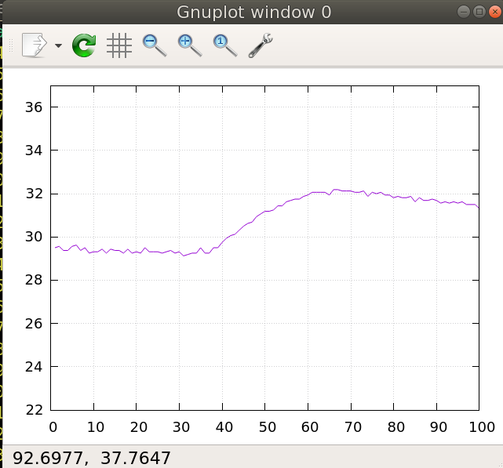

MAX30105 - Particle sensor and oximeter sensor (i2c)
====================================================

## References

### In this folder:

* [Breakout schematic](MAX30105_Breakout_Schematic_V10.pdf)
* [MAX03105 TRM](MAX30105_3.pdf)

### External links
* [Sparkfun "Hookup Guide"](https://learn.sparkfun.com/tutorials/max30105-particle-and-pulse-ox-sensor-hookup-guide)

## Running

* Show temperature from thumb:

(From SHA1 #8e684fc)

Display and record:

```bash
ehwe.sh -x100 | \
	tee /tmp/temp.txt | \
	feedgnuplot --stream 0.5 --xlen=20 --line --ymin=22 --ymax=3

```

Replay recording.:

```bash
cat /tmp/temp.txt | \
	feedgnuplot --line --ymin=22 --ymax=3
```


